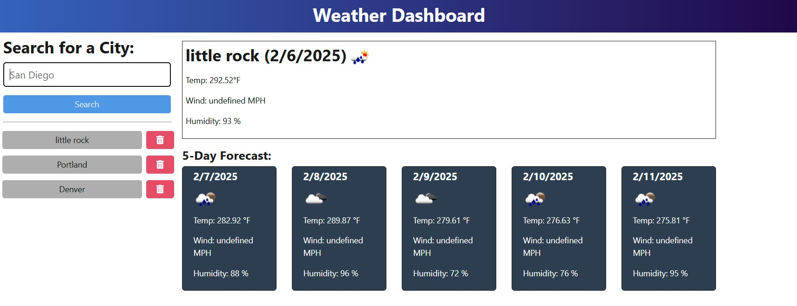

# Weather Dashboard

## Description

This project is a weather dashboard application that retrieves weather data from the OpenWeather API. Users can search for a city to view its current and 5-day weather forecast. The application stores search history and allows users to reselect previously searched cities.

## Features

- Search for a city to retrieve weather data
- View current weather conditions, including temperature, wind speed, and humidity
- View a 5-day forecast
- Save search history for easy access
- Delete cities from search history

## Technologies Used

- Node.js
- Express.js
- OpenWeather API
- Fetch API
- JSON file storage

## Installation

1. Clone the repository:
   ```sh
   git clone <repository-url>
   ```
2. Navigate to the project directory:
   ```sh
   cd weather-dashboard
   ```
3. Install dependencies:
   ```sh
   npm install
   ```
4. Create a `.env` file and add your OpenWeather API key:
   ```sh
   API_BASE_URL=https://api.openweathermap.org/data/2.5
   API_KEY=your_api_key_here
   ```
5. Start the server:
   ```sh
   npm start
   ```

## API Endpoints

- **GET /api/weather/history** - Retrieves search history from `searchHistory.json`
- **POST /api/weather** - Accepts a city name, saves it, and retrieves weather data
- **DELETE /api/weather/history/:id** - Removes a city from search history

## Deployment

The application is deployed to Render. You can access it [here](deployed-url).

## Usage

1. Enter a city name in the search bar.
2. View the current weather and 5-day forecast.
3. Click on a previously searched city to view its weather again.
4. Delete unwanted search history entries.

## Screenshot



## License

This project is licensed under the MIT License.

## Contact

For questions or suggestions, reach out via GitHub Issues.
